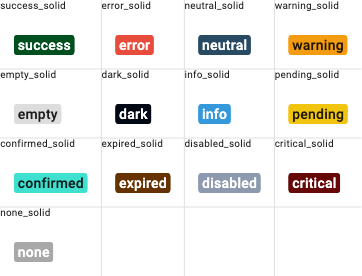
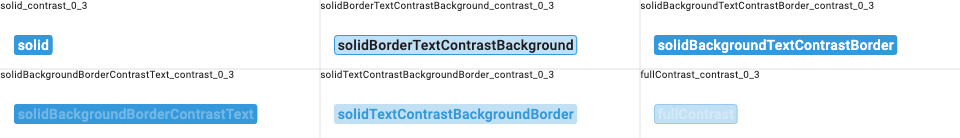
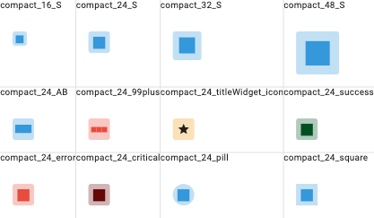
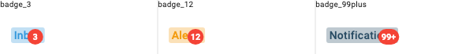
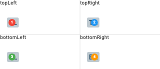
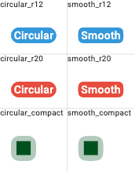
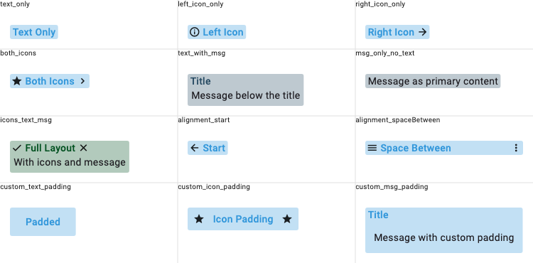
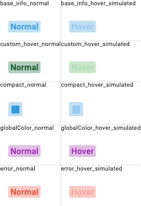

# Info Label

[](https://dart.dev/)
[](https://flutter.dev/)
[](https://pub.dev/packages/info_label)
[](https://opensource.org/licenses/MIT)

A high-performance Flutter label widget built on `CustomPainter`. Background, border, text, and overlay indicators are painted directly on canvas for minimal widget overhead.

## Features

- **13 label types** with auto-contrast text color
- **6 color distribution modes** (solid, contrast combinations, full contrast)
- **Compact mode** — fixed-size square with auto-scaled centered text
- **Overlay indicator** — dot, badge, text-only, or bordered badge (all painted, zero widgets)
- **iOS smooth corners** — squircle/superellipse via cubic bezier curves
- **Hover support** — paint-only repaint via `ValueNotifier` (no widget rebuild)
- **Composable** — compact, overlay, and hover can be combined freely

## Getting Started

```yaml
dependencies:
  info_label: ^2.0.0
```

```dart
import 'package:info_label/info_label.dart';
```

## Usage

### Basic label

```dart
InfoLabel(
  text: "Success",
  typeInfoLabel: TypeInfoLabel.success,
)
```

### With icons

```dart
InfoLabel(
  text: "Warning",
  typeInfoLabel: TypeInfoLabel.warning,
  leftIcon: Icon(Icons.warning, size: 16),
  rightIcon: Icon(Icons.arrow_forward, size: 16),
)
```

### Color distribution

```dart
InfoLabel(
  text: "Outlined style",
  typeInfoLabel: TypeInfoLabel.info,
  typeColor: TypeDistributionColor.solidBorderTextContrastBackground,
  contrastLevel: 0.2,
)
```

### Compact mode (badge/avatar)

```dart
// Single letter — full CustomPainter, 1 RenderObject
InfoLabel(
  text: "S",
  typeInfoLabel: TypeInfoLabel.info,
  compactSize: 24,
)

// Number
InfoLabel(
  text: "99+",
  typeInfoLabel: TypeInfoLabel.error,
  compactSize: 32,
)
```

### Overlay indicator

```dart
// Dot
InfoLabel(
  text: "Messages",
  typeInfoLabel: TypeInfoLabel.info,
  overlayColor: Colors.red,
  overlaySize: 8,
)

// Badge with number
InfoLabel(
  text: "Inbox",
  typeInfoLabel: TypeInfoLabel.info,
  overlayColor: Colors.red,
  overlaySize: 20,
  overlayText: "3",
)

// Text only (no background)
InfoLabel(
  text: "Tasks",
  typeInfoLabel: TypeInfoLabel.neutral,
  overlayText: "5",
  overlayTextColor: Colors.red,
  overlaySize: 16,
)

// Bordered badge
InfoLabel(
  text: "Chat",
  typeInfoLabel: TypeInfoLabel.info,
  overlayColor: Colors.white,
  overlayBorderColor: Colors.red,
  overlayText: "3",
  overlayTextColor: Colors.red,
  overlaySize: 20,
)
```

### iOS smooth corners

```dart
InfoLabel(
  text: "Smooth",
  typeInfoLabel: TypeInfoLabel.info,
  roundedCorners: 12,
  smoothCorners: true,
)
```

### Hover support

```dart
InfoLabel(
  text: "Hover me",
  typeInfoLabel: TypeInfoLabel.info,
  activeOnHover: true,
  onHoverColor: Colors.blue.withOpacity(0.2),
)
```

### Combining features

```dart
// Compact + overlay + hover
InfoLabel(
  text: "S",
  compactSize: 24,
  typeInfoLabel: TypeInfoLabel.info,
  overlayColor: Colors.red,
  overlaySize: 10,
  overlayText: "3",
  activeOnHover: true,
  smoothCorners: true,
  roundedCorners: 8,
)
```

### Custom colors

```dart
InfoLabel(
  text: "Custom",
  textColor: Colors.white,
  backgroundColor: Colors.indigo,
  borderColor: Colors.indigoAccent,
)

// Global color override
InfoLabel(
  text: "Global",
  globalColor: Colors.teal,
  contrastLevel: 0.3,
)
```

### Message widget

```dart
InfoLabel(
  text: "Title",
  typeInfoLabel: TypeInfoLabel.neutral,
  msg: Text("Additional description below"),
)
```

## Golden Tests

### Type Colors (solid)


### Color Distribution (contrast 0.3)


### Compact Mode


### Overlay Badges


### Overlay Positions


### Corner Comparison (circular vs smooth)


### Layout & Icons


### Hover States


## Migration from 1.x

### Breaking changes

| 1.x | 2.0 |
|-----|-----|
| `activeOnHover: true` (bool) | Same API, same behavior (now uses paint-only repaint) |
| `Widget? overlay` + `Stack` | `overlayColor` + `overlayText` + `overlayBorderColor` (painted) |
| `InfoLabelType` enum | Removed. Use composable flags: `compactSize`, `activeOnHover`, `overlayColor` |
| `DecoratedBox` rendering | `CustomPainter` rendering (visual output identical) |

### New parameters

| Parameter | Type | Default | Description |
|-----------|------|---------|-------------|
| `compactSize` | `double?` | `null` | Fixed size for compact square label |
| `smoothCorners` | `bool` | `false` | iOS-style squircle corners |
| `overlayColor` | `Color?` | `null` | Overlay circle fill color |
| `overlayBorderColor` | `Color?` | `null` | Overlay circle border color |
| `overlaySize` | `double` | `8.0` | Overlay circle diameter |
| `overlayText` | `String?` | `null` | Text/number inside overlay |
| `overlayTextColor` | `Color?` | `null` | Overlay text color |
| `overlayTop` | `double?` | `-2.0` | Overlay position from top |
| `overlayRight` | `double?` | `-2.0` | Overlay position from right |
| `overlayBottom` | `double?` | `null` | Overlay position from bottom |
| `overlayLeft` | `double?` | `null` | Overlay position from left |

## Documentation

- [API Documentation](https://pub.dev/documentation/info_label/latest/)

## Contributing

Contributions are welcome! Open an issue or submit a pull request on [GitHub](https://github.com/JhonaCodes/info_label).
